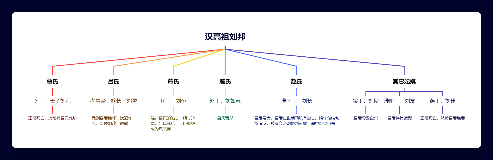

## 刘邦八子

> 是时高祖八子：长男肥，孝惠兄也，异母，肥为齐王；馀皆孝惠弟，戚姬子如意为赵王，薄夫人子恆为代王，诸姬子子恢为梁王，子友为淮阳王，子长为淮南王，子建为燕王。高祖弟交为楚王，兄子濞为吴王。

（1）刘肥

刘邦在没有娶吕氏之前，就和寡妇曹氏生下长子刘肥。刘邦称帝后，封刘肥为齐王，共七十余城，乃汉初第一大国，疆域辽阔，人口众多，相对较为富庶。

> 十月，孝惠与齐王燕饮太后前，孝惠以为齐王兄，置上坐，如家人之礼。太后怒，乃令酌两卮酖，置前，令齐王起为寿。齐王起，孝惠亦起，取卮欲俱为寿。太后乃恐，自起泛孝惠卮。齐王怪之，因不敢饮，详醉去。问，知其酖，齐王恐，自以为不得脱长安，忧。齐内史士说王曰：“太后独有孝惠与鲁元公主。今王有七十馀城，而公主乃食数城。王诚以一郡上太后，为公主汤沐邑，太后必喜，王必无忧。”於是齐王乃上城阳之郡，尊公主为王太后。吕后喜，许之。乃置酒齐邸，乐饮，罢，归齐王。三年，方筑长安城，四年就半，五年六年城就。诸侯来会。十月朝贺。

吕后预设毒酒加害刘肥，因孝惠帝的加入没有得逞。刘肥惶恐不安，献上一郡并尊公主为“齐国太后”，吕氏才肯罢休。

刘肥丢尽颜面，为了自保献出城池还把自己同父异母的妹妹认作太后，没人能咽下这口气，几年后逝世。

（2）刘如意

> 及高祖为汉王，得定陶戚姬，爱幸，生赵隐王如意。孝惠为人仁弱，高祖以为不类我，常欲废太子，立戚姬子如意，如意类我。戚姬幸，常从上之关东，日夜啼泣，欲立其子代太子。吕后年长，常留守，希见上，益疏。如意立为赵王後，几代太子者数矣，赖大臣争之，及留侯策，太子得毋废。

刘邦称帝后，最宠爱戚夫人，甚至有令刘如意取代太子刘盈的举动，只是后面刘邦见太子势力已经形成，才作罢。

> 吕后最怨戚夫人及其子赵王，乃令永巷囚戚夫人，而召赵王。使者三反，赵相建平侯周昌谓使者曰：“高帝属臣赵王，赵王年少。窃闻太后怨戚夫人，欲召赵王并诛之，臣不敢遣王。王且亦病，不能奉诏。”吕后大怒，乃使人召赵相。赵相徵至长安，乃使人复召赵王。王来，未到。孝惠帝慈仁，知太后怒，自迎赵王霸上，与入宫，自挟与赵王起居饮食。太后欲杀之，不得间。孝惠元年十二月，帝晨出射。赵王少，不能蚤起。太后闻其独居，使人持酖饮之。犁明，孝惠还，赵王已死。

因此，吕后最怨戚夫人及其子赵王，囚禁戚夫人，毒杀赵王刘如意，再将戚夫人弄成“人彘”。

（3）刘恒

> 秋，太后使使告代王，欲徙王赵。代王谢，原守代边。

前面好几位皇子都在赵王这个身份上惨死，代王这里拒绝，保住一命。

况且，代王镇守边疆的理由充足，外加其母薄氏早年也并不受刘邦重视，也是唯一被吕后放出宫的女人，其余妃子都呆在宫中。

（4）刘友

> 友以诸吕女为受后，弗爱，爱他姬，诸吕女妒，怒去，谗之於太后，诬以罪过，曰：“吕氏安得王！太后百岁後，吾必击之”。太后怒，以故召赵王。赵王至，置邸不见，令卫围守之，弗与食。其群臣或窃馈，辄捕论之，赵王饿，乃歌曰：“诸吕用事兮刘氏危，迫胁王侯兮彊授我妃。我妃既妒兮诬我以恶，谗女乱国兮上曾不寤。我无忠臣兮何故弃国？自决中野兮苍天举直！于嗟不可悔兮宁蚤自财。为王而饿死兮谁者怜之！吕氏绝理兮讬天报仇。”丁丑，赵王幽死，以民礼葬之长安民冢次。

吕氏把家族女人嫁给刘友为后，但刘友只爱自己的妃子，引得其后嫉妒并诬告。

吕氏召赵王并囚禁，活活饿死，并且不忘以百姓的身份安葬来羞辱一番。

（5）刘恢

> 梁王恢之徙王赵，心怀不乐。太后以吕产女为赵王后。王后从官皆诸吕，擅权，微伺赵王，赵王不得自恣。王有所爱姬，王后使人酖杀之。王乃为歌诗四章，令乐人歌之。王悲，六月即自杀。太后闻之，以为王用妇人弃宗庙礼，废其嗣。

吕氏把家族女人嫁给刘恢为后，但刘恢只爱自己的妃子，其后持毒酒杀死刘恢宠妃。

刘恢悲痛欲绝，自杀身亡。吕后听说之后，认为刘恢为了女人违背祖宗礼教，不再让他的后代继承王位。

（6）刘长

刘长之母赵姬，本来是赵王张敖的姬妾，献给了刘邦。后面张敖入狱，赵姬也跟着入狱，此时正怀着刘长。

赵姬多次求助不过，在狱中自杀，后由吕后带大。

（7）刘建

> 九月，燕灵王建薨，有美人子，太后使人杀之，无後，国除。

刘建正常死亡，被吕后绝后。

（8）刘盈

> 居数日，乃召孝惠帝观人彘。孝惠见，问，乃知其戚夫人，乃大哭，因病，岁馀不能起。使人请太后曰：“此非人所为。臣为太后子，终不能治天下。”孝惠以此日饮为淫乐，不听政，故有病也。

吕后唯一的儿子，被吕氏邀请观看戚夫人的惨状，生病一年有余，沉迷饮酒作乐，少理朝政，即位七年病故。

## 吕氏的手段

把自己的家族女人嫁给刘邦之子为后，起到监督作用。有诬告，有陷害，反正召进宫就是死亡宣判。

对于已经有太后的王，就绝后或者废除王位。

八子只剩下二子，要不是刘恒拒绝成为赵王，再加上镇守边疆这个理由充分，否则就只剩下刘长了。

