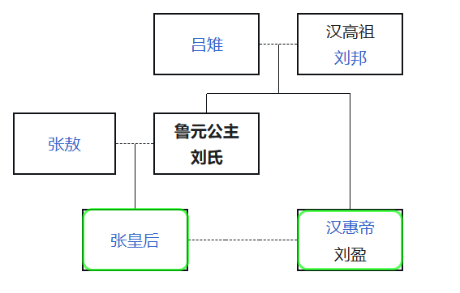

> 吕太后者，高祖微时妃也，生孝惠帝、女鲁元太后。

查维基百科见联姻关系：

此举，为吕后一人所为。让舅舅娶自己的外甥女为妻，吕后违反伦理也要这样做的原因是什么？

1. 巩固吕氏家族权力：将外甥女立为皇后，可使吕氏血脉直接融入皇族，未来皇子兼具吕、刘两族血统，保障吕家长期影响力。
2. 亲上加亲的伦理观念：汉代虽重视伦理，但表亲联姻在当时上层社会并不罕见。
3. 吕后对高贵身份的重视：吕雉称制时期想方设法地把自己吕氏家族的人封王封侯，她清楚地知道身份对应着权力。《史记》记载「齐王乃上城阳之郡，尊公主为王太后。」，也就是说高祖长子刘肥献上城阳之郡尚且不够，还得把自己的妹妹认作母亲，吕后才肯罢休。本以为这只是吕后刻意羞辱刘肥，没想到她真认可这种关系，她连自家人都不放过，让自己的外孙女得到皇后之位，刘肥实不冤枉。尽管真的荒唐至极，那不就是让孝惠帝叫自己的姐姐为岳母吗？真是乱套了，吕后掌权之后干的蠢事真不少，此乃其中一件。

刘盈对这桩违背人伦的婚姻极为抵触，史载他始终未与张嫣圆房，导致张嫣无子。吕后最终让张嫣假装怀孕，夺汉惠帝与宫人之子刘恭立为太子，刘恭继位（前少帝）后因得知身世被害，吕后死后诸吕被诛，张嫣也被废黜。

不过，有必要查查孝惠帝娶张嫣到自己驾崩时期两人的年龄，毕竟刘盈和姐姐鲁元公主相差一两岁，那么张嫣可能都不具备生育能力。

惠帝四年娶张嫣，惠帝七年驾崩，驾崩时二十三岁，那么当时惠帝二十岁，惠帝具备生育能力。维基百科记录有张嫣的死亡年份，却没有出生年份记录，那就只能调查鲁元公主了。然，鲁元公主与张敖的成婚时间已不可考，但我们知晓鲁元公主比惠帝先一年左右死亡，那我们可以估测认为鲁元公主和惠帝死去的年龄一致，即二十三岁左右。

汉朝女性大约在十四岁左右具备生育能力（现代医学表明过早生子，对身体伤害巨大，不知道鲁元公主是不是这个缘故早逝。），那我们假定鲁元公主十四岁生下张嫣，那么鲁元公主得活到二十八岁，张嫣才具备生育能力。也就是说，孝惠帝即便有意，也无能为力，我们按照最高年龄去算，张嫣在惠帝驾崩时候才十岁左右，嫁给惠帝时才七岁左右。

吕后为自己的愚蠢行为埋下的种子，导致自己的儿子血脉和吕氏家族从这个世上消失了。

---

原文中的鲁元太后表述存在问题，因为鲁元公主不可能是太后。

唐代司马贞的《史记索隐》是研究《史记》的重要著作，他在注解这一句时就明确写道：“案：谓鲁元公主也。太后之女，故曰‘女鲁元’也。‘太后’字误，当为‘主’字。” 意思是，这里说的是鲁元公主。因为是太后的女儿，所以称“女鲁元”。后面的“太后”是错的，应该是“主”字。这说明至少在唐代，学者们就已经认定这是一个文本错误了。
